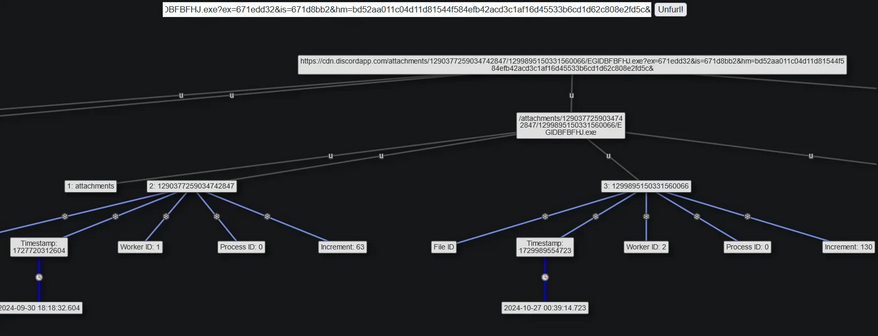
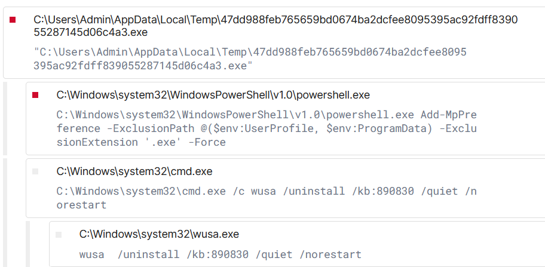

On a l'url discord suivante :
```
https://cdn.discordapp.com/attachments/1290377259034742847/1299895150331560066/EGIDBFBFHJ.exe?ex=671edd32&is=671d8bb2&hm=bd52aa011c04d11d81544f584efb42acd3c1af16d45533b6cd1d62c808e2fd5c&
```

Première action on va essayer de comprendre le contenu de l'url avec [Unfurl](https://dfir.blog/unfurl/)

On identifie dans le bloc principal de l'url des informations notament un FileID et un timestamp qui correspond à la date d'upload du fichier dans la conversation discord.
```
2024-10-27 00:39:14.723
```
On cherche ensuite à pivoter avec [urlhaus](https://urlhaus.abuse.ch/url/3258151/)

On va ensuite récupéré le sample sur [MalwareBazaar](https://bazaar.abuse.ch/sample/47dd988feb765659bd0674ba2dcfee8095395ac92fdff839055287145d06c4a3/)

Puis on se rend sur [tria.ge](https://tria.ge/241029-cadntazne1) pour faire une analyse dynamique du Malware récupéré.

On identifie dans les process enregistré que l'exe malveillant va dans un premier temps ajouter un path d'exclusion dans UserProfile et ProgramData pour faire taire Windows Defender puis à l'aide de l'utilitaire __wusa__ va desinstaller un KB spécifique de Windows Update



On peux supposer que le ciblage de ce KB spécifique est dû au fait que la suite de la killchain utilise une technique de privesc avec une vulnérabilité patché dans ce kb.