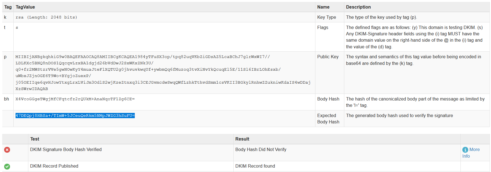

L'en-tête du return-path ("return-path header" en anglais) est une adresse email source SMTP ("SMTP MAIL FROM", en anglais) utilisée pour traiter les erreurs générées (par exemple, adresse email d'un contact incorrecte)

```
$ cat a63550b55a079090bbf2e718a860c7b5c6b2a9ba76f1b324e67c6f110f05932d | grep -i return-path
Return-Path: <1axbj19of276gl4u1me7u8w3ev1ohfe2yi1c6s-asdm2534=gmail.com@45160067m.email.ine.com>
Return-Path: <1axbj19of276gl4u1me7u8w3ev1ohfe2yi1c6s-asdm2534=gmail.com@45160067m.email.ine.com>
```


```
$ cat SuperCTFScam.eml | grep -i sender
       spf=pass (google.com: domain of 1axbj19of276gl4u1me7u8w3ev1ohfe2yi1c6s-asdm2534=gmail.com@45160067m.email.ine.com designates 158.247.23.73 as permitted sender) smtp.mailfrom="1axbj19of276gl4u1me7u8w3ev1ohfe2yi1c6s-asdm2534=gmail.com@45160067m.email.ine.com";
Received-SPF: pass (google.com: domain of 1axbj19of276gl4u1me7u8w3ev1ohfe2yi1c6s-asdm2534=gmail.com@45160067m.email.ine.com designates 158.247.23.73 as permitted sender) client-ip=158.247.23.73;
       spf=pass (google.com: domain of 1axbj19of276gl4u1me7u8w3ev1ohfe2yi1c6s-asdm2534=gmail.com@45160067m.email.ine.com designates 158.247.23.73 as permitted sender) smtp.mailfrom="1axbj19of276gl4u1me7u8w3ev1ohfe2yi1c6s-asdm2534=gmail.com@45160067m.email.ine.com";
        h=sender:from:from:reply-to:to:to:cc:cc:subject:subject:list-unsubscribe:form-sub:feedback-id:list-unsubscribe-post;
        h=sender:from:from:reply-to:to:to:cc:cc:subject:subject:list-unsubscribe:form-sub:feedback-id:list-unsubscribe-post;

```


(MxToolBox)[https://mxtoolbox.com/Public/Tools/EmailHeaders.aspx?huid=c2ef611d-dab1-4f4b-8c0c-da006a9f0bb1] pour la suite de l'analyse



