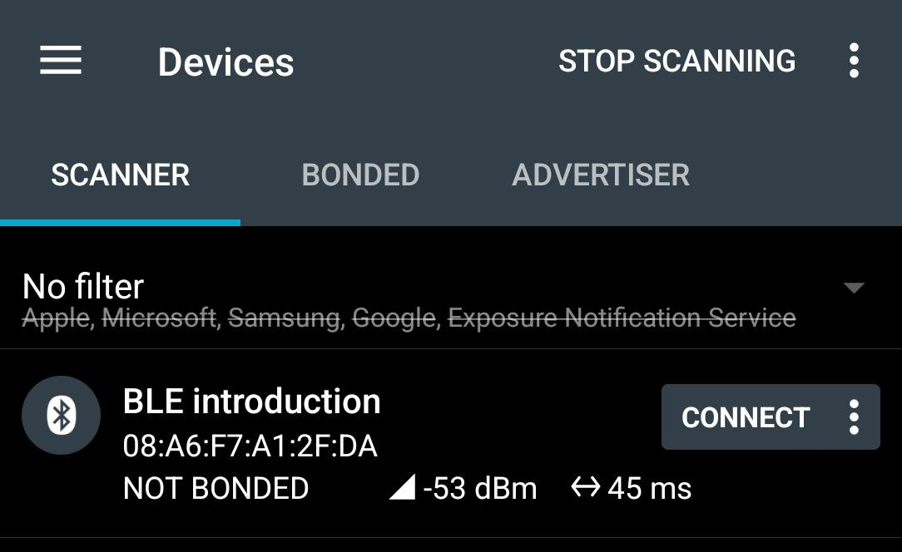
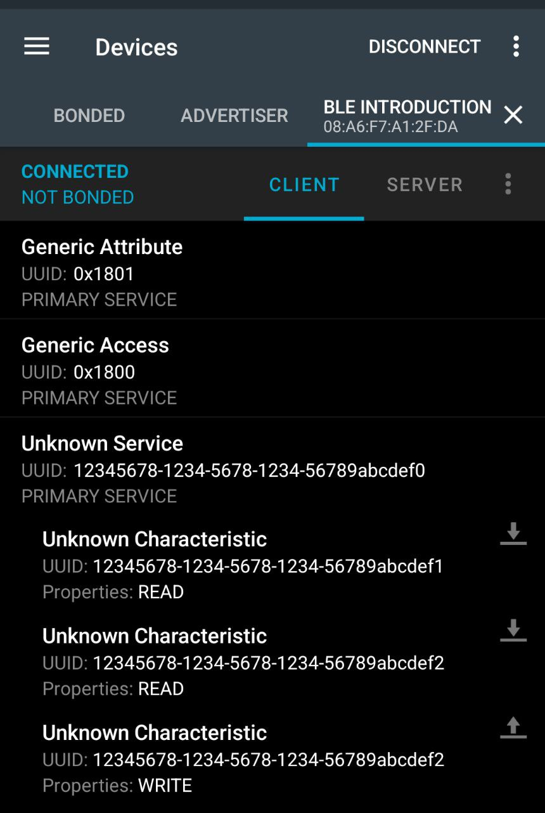
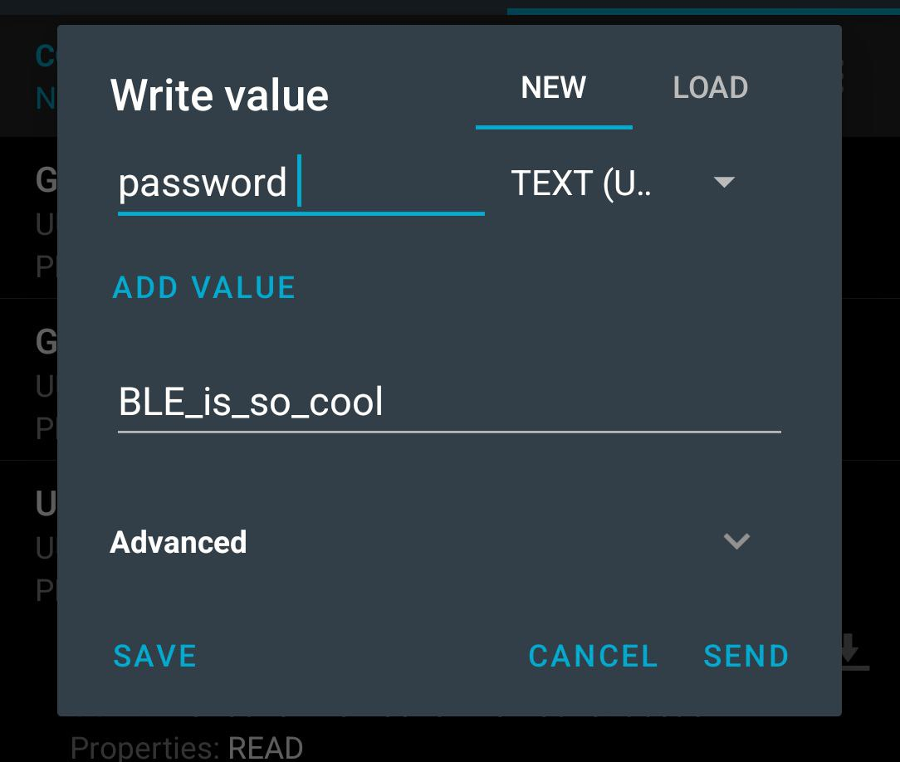
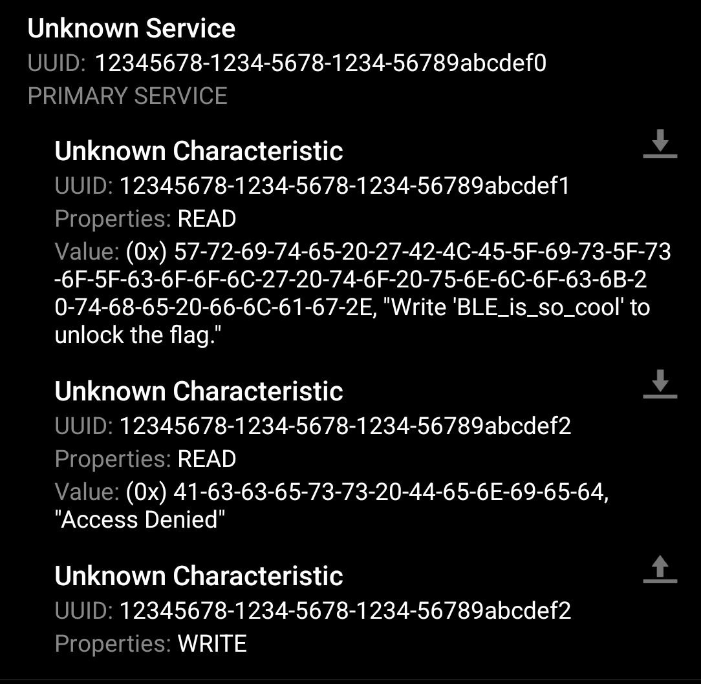
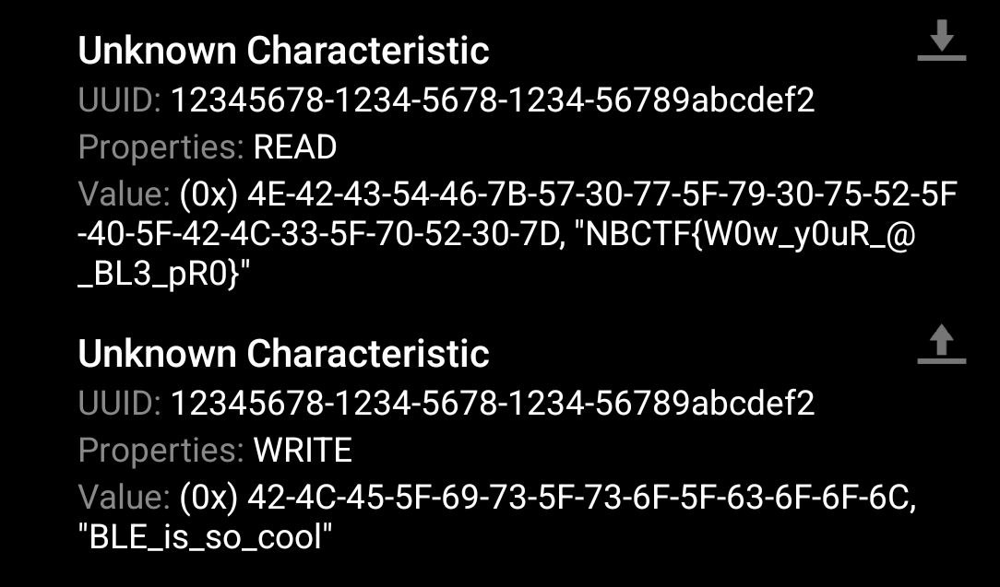

Votre tâche est simple : vous devrez scanner, interagir et découvrir le secret du coffre BLEu.
Armez-vous d'un équipement compatible BLE (votre ordinateur, votre téléphone portable...). 

Attention, il n'y a qu'un seul device pour toutes les équipes !
Une fois que vous avez maîtrisé la documentation (ou si vous êtes déjà un crack du BLE), venez voir Philippe_Katerine (envoyez un ping sur Discord) pour commencer le challenge. Vous aurez alors 20 minutes pour accéder au secret du coffre.

Si, après ces 20 minutes, vous n'avez pas réussi à obtenir le flag, et pour assurer l'équité entre les équipes, nous ferons tourner le challenge. Vous pourrez réessayer, mais uniquement quand votre tour viendra !"

------------------------------------------------------------------------
## Étape 1 : Connexion au device

On commence par scanner les devices BLE autour de nous :

```
eddymalou@parrot:~$ bluetoothctl
Agent registered
[bluetooth]# power on
Changing power on succeeded
[bluetooth]# scan on
Discovery started
[CHG] Controller E4:0D:36:43:02:6E Discovering: yes
[NEW] Device 08:A6:F7:A1:2F:DA coffre BLEu

```
 
On identifie un device intéressant nommé `coffre BLEu` avec l'adresse MAC `08:A6:F7:A1:2F:DA`.

Ensuite, on se connecte au device avec `gatttool` pour interagir en BLE :

```
eddymalou@parrot:~/Documents/CTF/NOBRACKET/Finale/coffre_BLEu$ gatttool -b 08:A6:F7:A1:2F:DA -I
[08:A6:F7:A1:2F:DA][LE]> connect
Attempting to connect to 08:A6:F7:A1:2F:DA
Connection successful
```

------------------------------------------------------------------------
### Étape 2 : Liste des services

On liste les services actifs sur le device. Deux services standards sont visibles, ainsi qu’un service custom avec un UUID unique `12345678-1234-5678-1234-56789abcdef0` :

```
[08:A6:F7:A1:2F:DA][LE]> primary
attr handle: 0x0001, end grp handle: 0x0005 uuid: 00001801-0000-1000-8000-00805f9b34fb
attr handle: 0x0014, end grp handle: 0x001c uuid: 00001800-0000-1000-8000-00805f9b34fb
attr handle: 0x0028, end grp handle: 0xffff uuid: 12345678-1234-5678-1234-56789abcdef0
```

------------------------------------------------------------------------
### Étape 3 : Liste des caractéristiques

On liste les caractéristiques de chaque service. On observe trois caractéristiques pour le service custom, avec les handles des valeurs `0x002a`, `0x002c`, et `0x002e`.

Les propriétés des caractéristiques sont :

- `0x002a` : propriété `0x02` (lecture)
- `0x002c` : propriété `0x02` (lecture)
- `0x002e` : propriété `0x08` (écriture uniquement)

```
[08:A6:F7:A1:2F:DA][LE]> characteristics 
handle: 0x0002, char properties: 0x20, char value handle: 0x0003, uuid: 00002a05-0000-1000-8000-00805f9b34fb
handle: 0x0015, char properties: 0x02, char value handle: 0x0016, uuid: 00002a00-0000-1000-8000-00805f9b34fb
handle: 0x0017, char properties: 0x02, char value handle: 0x0018, uuid: 00002a01-0000-1000-8000-00805f9b34fb
handle: 0x0019, char properties: 0x02, char value handle: 0x001a, uuid: 00002aa6-0000-1000-8000-00805f9b34fb
handle: 0x0029, char properties: 0x02, char value handle: 0x002a, uuid: 12345678-1234-5678-1234-56789abcdef1
handle: 0x002b, char properties: 0x02, char value handle: 0x002c, uuid: 12345678-1234-5678-1234-56789abcdef2
handle: 0x002d, char properties: 0x08, char value handle: 0x002e, uuid: 12345678-1234-5678-1234-56789abcdef3
```

------------------------------------------------------------------------
### Étape 4 : Lecture des valeurs

On lit les valeurs des caractéristiques accessibles en lecture (`0x002a` et `0x002c`) pour voir si elles contiennent des informations utiles

```
[08:A6:F7:A1:2F:DA][LE]> char-read-hnd 0x002a
Characteristic value/descriptor: 57 72 69 74 65 20 27 42 4c 45 5f 69 73 5f 73 6f 5f 63 6f 6f 6c 27 20 74 6f 20 75 6e 6c 6f 63 6b 20 74 68 65 20 66 6c 61 67 2e 
[08:A6:F7:A1:2F:DA][LE]> char-read-hnd 0x002c
Characteristic value/descriptor: 41 63 63 65 73 73 20 44 65 6e 69 65 64 
[08:A6:F7:A1:2F:DA][LE]> char-read-hnd 0x002e
Characteristic value/descriptor: 

```

Les deux premiers handles retournent des valeurs en hexadécimal. Le troisième handle ne retourne rien, ce qui est attendu car il est en écriture uniquement (`0x08`).

------------------------------------------------------------------------
### Étape 4 : Conversion en ASCII

On convertit les valeurs hexadécimales en ASCII pour voir leur contenu

```
eddymalou@parrot:~/Documents/CTF/NOBRACKET/Finale/coffre_BLEu$ echo -n "57 72 69 74 65 20 27 42 4c 45 5f 69 73 5f 73 6f 5f 63 6f 6f 6c 27 20 74 6f 20 75 6e 6c 6f 63 6b 20 74 68 65 20 66 6c 61 67 2e" | xxd -r -p

-> Write 'BLE_is_so_cool' to unlock the flag.

eddymalou@parrot:~/Documents/CTF/NOBRACKET/Finale/coffre_BLEu$ echo -n "41 63 63 65 73 73 20 44 65 6e 69 65 64" | xxd -r -p

-> Access Denied
```

------------------------------------------------------------------------
### Étape 5 : Envoi de la commande et récupération du flag

D’après le premier message, il faut envoyer `BLE_is_so_cool` au handle d’écriture `0x002e`. On convertit cette chaîne en hexadécimal :

```
eddymalou@parrot:~/Documents/CTF/NOBRACKET/Finale/coffre_BLEu$ echo -n "BLE_is_so_cool" | xxd -p
-> 424c455f69735f736f5f636f6f6c
```

Ensuite, on l’écrit au handle d’écriture avec `char-write-cmd` :

```
[08:A6:F7:A1:2F:DA][LE]> char-write-cmd 0x002e 424c455f69735f736f5f636f6f6c
```

Enfin, on relit la valeur de `0x002c` pour obtenir le flag :

```
[08:A6:F7:A1:2F:DA][LE]> char-read-hnd 0x002c
Characteristic value/descriptor: 4e 42 43 54 46 7b 57 30 77 5f 79 30 75 52 5f 40 5f 42 4c 33 5f 70 52 30 7d 
```

On effectue une dernière conversion pour lire le flag :
```
eddymalou@parrot:~/Documents/CTF/NOBRACKET/Finale/coffre_BLEu$ echo -n "4e 42 43 54 46 7b 57 30 77 5f 79 30 75 52 5f 40 5f 42 4c 33 5f 70 52 30 7d" | xxd -p -r
NBCTF{W0w_y0uR_@_BL3_pR0}
```

------------------------------------------------------------------------

### Solve alternatif avec l'application mobile nrfconnect : 

## Étapes du challenge

1. **Scan des périphériques BLE**  
   

2. **Liste des services et caractéristiques du périphérique**  
   
   3. **Ajout du mdp trouvé en ASCII ("text UTF-8")**  
   
4. **Lecture des valeurs des caractéristiques**  
   
  5. **Flag  après envoi de la commande**  
   
