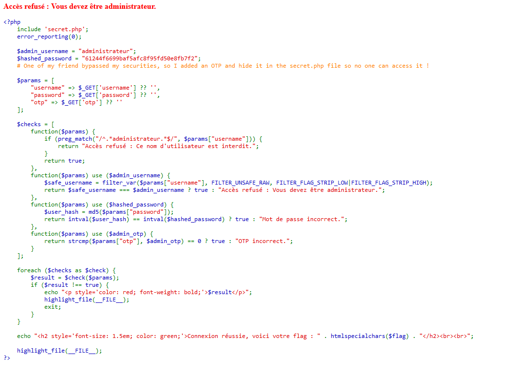
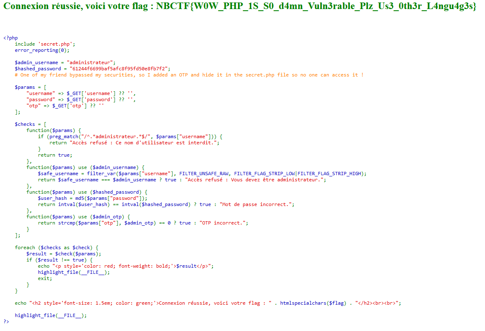

# Secure Authentication
> Auteur : Al-oxos

## Recon

La description du challenge nous indique que l'application est en php et qu'il va falloir contourner plusieurs vérifications sur cette authentification pour obtenir le flag.
En accédant à l'application, nous voyons un message d'erreur nous indiquant que nous devons être administrateur et nous avons le code source de l'application.



En analysant rapidement ce code source, nous comprenons qu'il va être nécessaire de contourner 4 conditions (en réalité plutôt 3) afin d'obtenir le flag a la fin.
Nous pouvons utiliser trois paramètres en GET sur la page, respectivement `username`, `password` et `otp` qui seront utilisés dans les différentes conditions à passer.

Les deux premières conditions (qui fonctionnent ensemble) sont les suivantes et utilisent le paramètre `username`: 

```php
function($params) {
    if (preg_match("/^.*administrateur.*$/", $params["username"])) {
        return "Accès refusé : Ce nom d'utilisateur est interdit.";
    }
    return true;
},
function($params) use ($admin_username) {
    $safe_username = filter_var($params["username"], FILTER_UNSAFE_RAW, FILTER_FLAG_STRIP_LOW|FILTER_FLAG_STRIP_HIGH);
    return $safe_username === $admin_username ? true : "Accès refusé : Vous devez être administrateur.";
}
```
En réalisant quelques recherches rapides, nous nous rendons compte que la regex utilisé utilisé dans preg_match débute par `^` et se termine par `$`.
Cela peut sembler anodin mais en réalité, la regex ne s'applique que sur la première ligne de la chaine passé dans le paramètre `username` en raison de la présence de `^`.
En utilisant un chariot `\n` dans notre chaine, nous pouvons alors bypasser cette condition. Pour cela, nous pouvons utiliser `%0a` qui est l'encodage url de `\n`.

La troisième condition utilise le paramètre `password` et est la suivante :

```php
function($params) use ($hashed_password) {
    $user_hash = md5($params["password"]);
    return intval($user_hash) === intval($hashed_password) ? true : "Mot de passe incorrect.";
}
```

Cette fonction est relativement simple à comprendre, elle va comparer le hashé md5 de notre paramètre `password` avec un hashé prédéfini. Cependant, la comparaison est faite en castant les deux hashés en entier. Cela est une grosse erreur car le hashé md5 de notre mot de passe est composé de chiffres et de lettres. En castant ces hashés en entier, nous nous retrouvons avec une valeur entière qui s'arrête directement à la première lettre du hash (Exemple : `198298ff98198abc deviendra 198298 une fois casté en int`). 
Pour contourner cette condition, nous pouvons simplement trouver un mot de passe qui a pour première valeurs une fois hashé en md5 61244 puis n'importe quelle lettre derrière car notre hash initial est `61244f6699baf5afc8f95fd50e8fb7f2 qui casté en int donne 61244`.
Nous pouvons réaliser un petit script pour trouver un mot de passe qui respecte ces conditions :

```python
import hashlib
import random
import string

target_prefix = "61244"

def starts_with_prefix_and_letter(hash_value, prefix):
    return hash_value.startswith(prefix) and hash_value[len(prefix)].isalpha()

found = False

while not found:
    # Générer une chaîne aléatoire
    text = ''.join(random.choices(string.ascii_letters + string.digits, k=8))
    hash_result = hashlib.md5(text.encode()).hexdigest()
    
    # Vérifier si le hash commence par le préfixe et contient une lettre derrière
    if starts_with_prefix_and_letter(hash_result, target_prefix):
        print(f"Texte trouvé : {text} -> MD5 : {hash_result}")
        found = True
```

En exécutant ce script, nous obtenons le mot de passe `EU25p6SN` qui respecte les conditions (bien d'autres doivent exister), le script trouve un résultat en moins de 2 secondes.

La dernière condition utilise le paramètre `otp` et est la suivante :

```php
function($params) use ($admin_otp) {
    return strcmp($params["otp"], $admin_otp) == 0 ? true : "OTP incorrect.";
}
```
Cette condition est relativement simple à contourner, il suffit de modifier le type de notre paramètre `otp` afin de le transformer en array.
Strcmp va alors comparer un array avec une string, ce qui va retourner un warning et nous permettre de bypasser cette condition car la loose comparison avec 0 sera valide.
**Attention: Cette vulnérabilité n'est possible que parceque nous utilisons PHP dans une version inférieur à PHP8. Ces versions étant obsolète, il ne faut plus les utiliser ! Depuis PHP8, de vrai gestion des erreurs ont été mises en place sur les fonctions strcmp et strcasecmp ce qui permet d'éviter les looses comparisons valides comme dans notre cas**

## Challenge solve

Maintenant que nous avons trouvé des moyens de contourner toutes les conditions, il ne nous reste plus qu'à exploiter cela pour obtenir le flag.
Nous utiliserons le payload final suivant : `?username=%0Aadministrateur&password=EU25p6SN&otp[]=`.
Une fois notre payload envoyé, il ne nous reste plus qu'à profiter de notre flag :P

