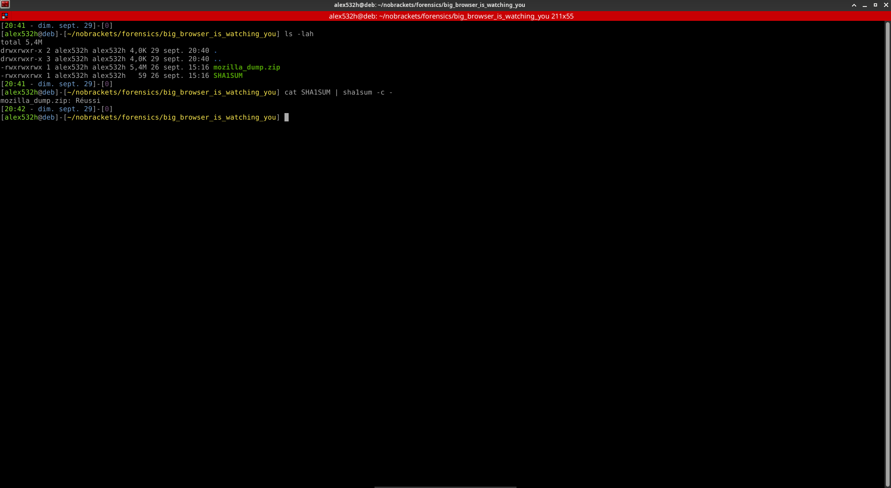

# Big Browser Is Watching You

## Vérification de l'intégrité

Une bonne pratique à avoir en forensics est de vérifier, quand c'est possible, l'intégrité des données.

Pour cela, comme on a un checksum SHA1, on utilise la commande:
```bash
cat SHA1SUM | sha1sum -c -
```



## Enoncé

> Un de nos agents infiltrés, Winston Smith, a réussi à accéder au PC d'un membre du gouvernement. Il en a extrait les données du navigateur installé et nous les a faites parvenir.  
Nous pensons qu'ils utilisent un site ultraconfidentiel pour communiquer et préparer leurs actions politiques.  
Pouvez-vous récupérer l'URL et l'email utilisé ?

D'après l'énoncé, nous savons que `Winston Smith` nous a fait parvenir les données d'un navigateur, et qu'il faut récupérer les données stockées.

## Analyse

En s'appuyant sur les données de l'énoncé, en faisant des recherches internet, on peut trouver qu'il faut regarder dans les fichiers:
- places.sqlite
- formhistory.sqlite

Ces fichiers stockent respectivement:
- l'historique de navigation
- les entrées utilisateur de formulaires (d'authentification par exemple)

Si l'on n'arrive pas à trouver ces informations, il est possible de commencer par chercher les occurences de `Winston` dans l'ensemble du cache du navigateur.

```bash
grep -nir 'winston'
```


A partir de là, on peut ouvrir le fichier avec `sqlitebrowser`.


On y voit plusieurs adresses mail. Parmi celles-ci, les suivantes peuvent être intéressantes:
- winston.smith@airstrip-one.com
- o.brien@airstrip-one.com
- o.brien@airstripone.com

Le format de l'adresse mail de `Winston Smith` nous fait penser que celle qu'on cherche est: `o.brien@airstrip-one.com`.

Il ne reste plus qu'à trouver l'URL.

Si l'on ne sait toujours pas où chercher, on peut faire une recherche sur `airstrip`

```bash
grep -nir 'airstrip'
```


La recherche montre un résultat, `airstrip-one.com`, mais vérifions le dans le fichier `places.sqlite`.


Bingo. Nous obtenons l'url complète: `https://airstrip-one.com`.

Le flag est donc:
```
NBCTF{https://airstrip-one.com/:o.brien@airstrip-one.com}
```