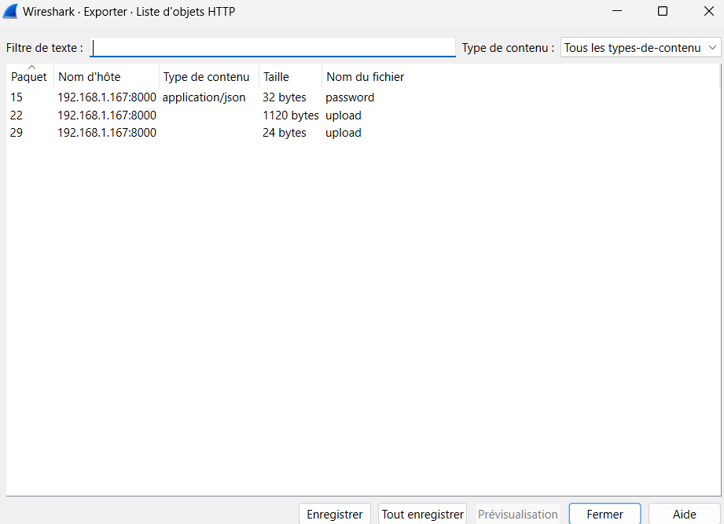

Dans un premier temps on extrait les objets http :




L'objet password contient le mot de passe utilisé par le client pour chiffrer l'archive qu'il va envoyer au serveur

```
$ ls ../../Exfiltration_is_the_key/srv/srv/chall/
 password   upload  'upload(1)'

$ cat password
{"password": "0vK0b7aDIFZ2Y4kV", "aes_key": "670f0b6506664804694ec261fc0a0db459229e35527c67f7e35f20db1706b156", "iv": "747061614a77664f63325a67756a4941"}

$ cat upload\(1\)
File received and saved.
```

Le fichier upload contient le zip chiffré avec de l'AES

On déchiffre avec le script python suivant en remplacant encrypted_file_path, la clé AES et l'iv  par les bonnes valeurs.

```
import os
import zipfile
import io
from Crypto.Cipher import AES
from Crypto.Util.Padding import unpad

def decrypt_and_unzip(encrypted_file_path, aes_key_hex, iv_hex):
    # Convert the AES key and IV from hex to bytes
    aes_key = bytes.fromhex(aes_key_hex)
    iv = bytes.fromhex(iv_hex)

    # Ensure the key and IV lengths are correct
    assert len(aes_key) == 32, f"AES key length is {len(aes_key)}, expected 32 bytes."
    assert len(iv) == 16, f"IV length is {len(iv)}, expected 16 bytes."

    # Read the encrypted data from the file
    with open(encrypted_file_path, 'rb') as f:
        encrypted_data = f.read()

    # Initialize AES cipher for decryption using the key and IV
    cipher = AES.new(aes_key, AES.MODE_CBC, iv)

    try:
        # Decrypt the data
        decrypted_data = unpad(cipher.decrypt(encrypted_data), AES.block_size)

        # Use BytesIO to handle the decrypted zip data
        zip_buffer = io.BytesIO(decrypted_data)
        
        # Extract the zip file contents
        extraction_dir = 'extracted_contents'
        os.makedirs(extraction_dir, exist_ok=True)
        with zipfile.ZipFile(zip_buffer, 'r') as zip_ref:
            zip_ref.extractall(extraction_dir)

        return extraction_dir
    except ValueError as e:
        print(f"Error during decryption: {e}")
        return None

# Example usage:
if __name__ == "__main__":
    # Example path to the encrypted file
    encrypted_file_path = 'received_exfiltration.zip'  # Replace with actual path to the encrypted file
    
    # AES key and IV provided (replace with actual values)
    aes_key_hex = "670f0b6506664804694ec261fc0a0db459229e35527c67f7e35f20db1706b156"
    iv_hex = "747061614a77664f63325a67756a4941"

    # Decrypt and unzip the received data
    extracted_dir = decrypt_and_unzip(encrypted_file_path, aes_key_hex, iv_hex)

    if extracted_dir:
        print(f"Files extracted to: {extracted_dir}")
    else:
        print("Decryption failed.")
```
On obtient 5 fichier png qui sont en fait de la data, en reconstruisant la base64, à l'aide de cyberchef, par exemple, on obtient un zip.
```
$ cat extracted_contents/*
�PNG
␦
UEsDBBQAAAAIALeu1VifoOYF7wAAAAICAAAQABwAYWNjZXNzX2NvZGVzLnR4dFVUCQADqS52ZqkudmZ1eAsAAQToAwAABOgDAAB1kTtOxDAQhvuc�PNG
␦
YiSKLSFxnnSwokDaYiUk+sEZwCKyw9jeM5GeG/hiTFgKQI5lF/P4NP/8PjoOBOOObOC0EMxsrDYzTlQUIGfvxrWMWqcPD9dQ91V5URQPOE2SJw+e�PNG
␦
+ESRfb59aFQn7Qd8cozBGV4hYNKvxPLyUFt31a8ZoN0q7vMc+LToyCakJQ/3qmwFvo1MGGGUK0N1EIn5/mq4qv8shCLMnGhjobJr1D9tz2lhsprg�PNG
␦
8f64oalSg0A351hsCJeBmNH7LZfbvhHg7udTpDgjvxn7At7Fb9TYPNkM9arv4DROEMRna97jxpRODeLzF1BLAQIeAxQAAAAIALeu1VifoOYF7wAA�PNG
␦
AAICAAAQABgAAAAAAAEAAACkgQAAAABhY2Nlc3NfY29kZXMudHh0VVQFAAOpLnZmdXgLAAEE6AMAAAToAwAAUEsFBgAAAAABAAEAVgAAADkBAAAA
```

Une fois dezippé on obtient le fichier avec les codes d'accès
```
$ cat access_codes.txt
Porte d'entrée principale

    Code d'accès : 4821#

Salle des serveurs

    Code d'accès : 9537#

Laboratoire de recherche

    Code d'accès : 6472#

Salle de contrôle de sécurité

    Code d'accès : 8316#

Bureau du directeur

    Code d'accès : 2904#

Salle des archives

    Code d'accès : 1753#

Salle de conférence VIP

    Code d'accès : 8239#

Accès toit/terrasse

    Code d'accès : 4685#

Entrée de parking souterrain

    Code d'accès : 5943#

Local technique

    Code d'accès : 7392#
```
