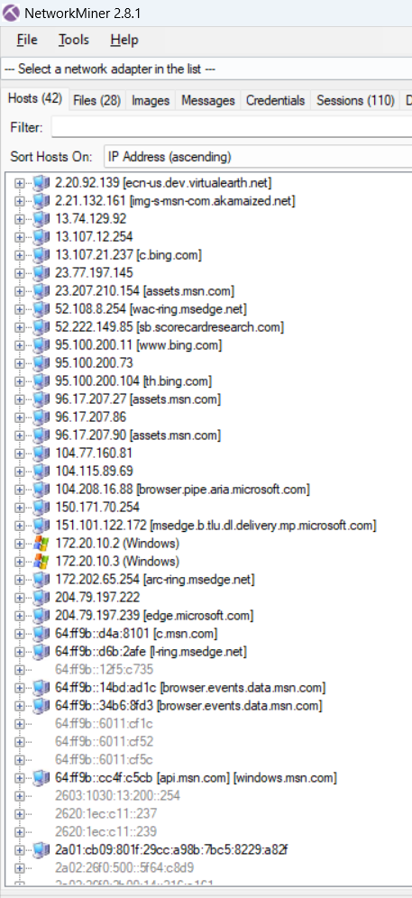
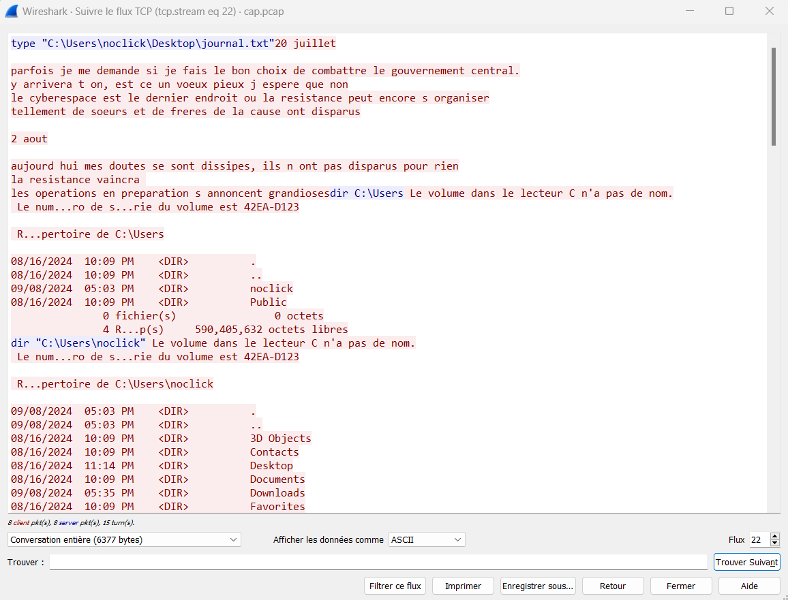

# Implant 3/3

Rappel du challenge : 

> Récapitulons : `IMPORTANT_nouvel_exploit_drone_a_tester.exe` est notre malware qui a été téléchargé par `noclick`. Il l'a lancé le `2024-09-08 15:20:39` par le biais de `cmd.exe` (ce qu'il a vraiment fait c'est de lancer le virus **depuis** le terminal (`cmd.exe`)). Mais... que fait vraiment ce virus ? Quelles sont ses capacités ? L'informateur vous fournit un fichier qui contient l'activité réseau de l'ordinateur de `noclick` au moment de l'infection. Vous devez identifier les **commandes** que le pirate a exécuté sur la machine de `noclick`.

Un indice gratuit donne l'adresse IP de `noclick` : `172.20.10.3`.

## Pourquoi un dump réseau ?

L'idée est d'observer ce que l'attaquant a fait pendant qu'il contrôlait l'ordinateur de `noclick`. Si vous avez lu la partie bonus de la partie 2, vous avez déjà une idée. Pour cela, rien de mieux que d'enregistrer ce qu'il se passe sur le réseau car, généralement, un malware communique avec son `C2` : "*command and control*". C'est là que l'attaquant se cache et c'est depuis ce serveur distant, situé quelques part sur Internet, qu'il peut piloter son malware. En analysant l'état du réseau au moment de l'infection, on pourra se faire une idée très précise des actions effectuées par le malware.

> En réalite, le C2 ne se trouvait pas sur Internet mais sur un réseau **privé**. Cela pour simplifier la création du challenge. C'est annecdotique ici mais toujours bon de le préciser. En fait, la machine infectée était une machine virtuelle et communiquait avec la machine hôte (machine de l'attaquant : le C2).

## A l'aide, je ne comprends rien !

Pas de panique. Le challenge était volontairement plus difficile que les deux parties précédentes. Ce qu'il se passe sur un réseau est par nature éphémère ; une fois que la donnée est passée d'une machine à une autre, elle est passée. C'est pour cela qu'ici vous avez une **sauvegarde** de tout ce qu'il s'est passé sur le réseau pendant environ 2 minutes.

Il se passe des tonnes de choses sur un réseau, à différents niveaux. Des informations sont échangées continuellement entre différentes machines/programmes. Afin de formaliser la façon dont deux machines s'échangent de la donnée, on utilise des **protocoles**. Un protocole sert à définir, à l'avance, le format des données, leurs type, ce qu'elles signifient etc... Vous connaissez sûrement les plus connus : HTTP, TCP/IP, DNS...

Pour simplifier le challenge, j'ai filtré uniquement le protocole **TCP** (car le malware communique avec son C2 en utilisant TCP). Si je n'avais pas fait cela, vous auriez vu des requêtes HTTP, DNS etc... ce qui aurait fait autant de fausses pistes et de bruits parasites.

## Wireshark ?

La manière la plus commune d'analyser un dump réseau est d'utiliser [Wireshark](https://www.wireshark.org/download.html). C'est un outil très puissant et complet. Vous trouverez des tas de tutoriels en ligne. Ici, on va s'intéresser aux fonctionnalités les plus basiques, à savoir le **filtrage** et le **suivi de flux**.

### Ce qu'envoi nofix

On émet l'hypothèse que la machine de `noclick` communique avec une machine distante : le C2. Puisqu'on connaît l'IP de `noclick`, on peut filtrer **tout ce qu'envoie sa machine**. L'idée est d'identifier l'adresse IP du C2 afin de se débarasser du bruit.

<figcaption>Filtrage de ce qui provient de la machine de `nofix` grâce à une requête (barre verte).</figcaption>

Bon... je ne sais pas pour vous, mais je ne vois rien d'étrange à première vue. Il y a pas mal d'adresses IP différentes. De plus, lorsqu'on clique sur un paquet, on tombe parfois sur du texte, parfois sur un charabiat incompréhensible (coin inférieur droit de l'écran).

> Wireshark essaie de traduire le binaire en lettres lorsqu'il le peut. Parfois, quand les paquets contiennent du texte, cela peut nous être utile. Néanmoins, le plus souvent, les données sont en binaire.

C'est ici que la difficulté se trouve : il faut démêler et comprendre les différents paquets réseau et fouiller. Cela peut être une bonne idée mais je vais vous fournir un outil très intéressant dans ce cas de figure et assez peu connu.

### NetworkMiner à la rescousse !

[NetworkMiner](TODO) est un outil qui permet de visualiser autrement une capture réseau. Là où [Wireshark](https://www.wireshark.org/download.html) vous montre les **paquets**, [NetworkMiner](TODO) vous montre les **machines**. Or, c'est justement de cela dont nous avons besoin.

> Pour utiliser [NetworkMiner](TODO) avec le fichier fournit, il faudra le convertir en `.pcap`. Je vous laisse chercher par vous-même comment le faire (on peut le faire depuis [Wireshark](https://www.wireshark.org/download.html)).

Lorsqu'on ouvre le dump réseau, on tombe sur cet interface et tout devient plus clair !

<figcaption>Toutes les IP de chaque machine qui figure dans le dump réseau.</figcaption>

Si ce n'est pas clair, pas de panique je vais vous expliquer. On voit ici pas mal d'adresses IP et des noms de domaine. Bon, on peut se dire que les noms de domaines sont légitimes, qu'ils n'entrent pas en compte dans l'attaque. Souvenons-nous de ce qu'on cherche : une machine qui communique avec celle de `nofix`. Quelle pourrait être cette machine ?

On a ici 2 machines identifiées comme étant des Windows : 

- `172.20.10.3` (`nofix`)

- `172.20.10.2` qu'on ne connaît pas !

On a ici une adresse IP qui pourrait correspondre à celle de notre attaquant. Retournons sur [Wireshark](https://www.wireshark.org/download.html) afin de voir quelles sont les informations échangées entre ces deux machines.

<figcaption>Ce qu'envoi la machine suspecte à celle de `nofix`.</figcaption>

Afin de suivre la **conversation** (ce que se "disent" les machines entre-elles), on fait clic droit sur un paquet > Suivre > Flux TCP.

<figcaption>Conversation entre les deux machines.</figcaption>

### Spyware

> Contraction de *"spy"* (espionner) et *"software"* (logiciel) : un logiciel espion.

Les personnes parmi vous qui ont déjà tapés quelques commandes sur le terminal Windows ont déjà compris : 

- `type` permet d'afficher le contenu d'un fichier (`cat` sous Linux).

- `dir` permet de lister ce qui se trouve dans un dossier (`ls` sous Linux).

L'attaquant (bleu) lance des commandes pour voir le contenu de dossiers et afficher les fichiers à l'intérieur. La victime (rouge) exécute les commandes et envoi cela à l'attaquant. **L'attaquant est en train de récupérer ce que contient l'ordinateur de `nofix`.**

En fait, le malware permet un accès à distance à la machine de `nofix`. De son côté, l'attaquant doit attendre que `nofix` exécute son malware. Se faisant, la machine victime envoi une demande de connexion, que l'attaquant accepte. Tant que le malware s'exécute, l'attaquant peut exécuter des commandes sur la machine infectée.

On sait quelles commandes ont été exécutées par l'attaquant, il ne vous reste qu'à écrire le flag.

L'attaquant aurait aussi pu lancer un programme, un script Powershell... Tout ce qu'on aurait pu faire depuis un invite de commande !

## Pour conclure et aller plus loin

Ce *spyware* est très basique. En réalité, il initie une connexion TCP avec l'adresse IP de l'attaquant (en dur dans le code), une fois cette connexion établie, il exécute les commandes que lui envoie l'attaquant. Enfin, le programme retourne le résultat des commandes à l'attaquant.

Il n'y a pas de chiffrement de la connexion comme cela est souvent le cas pour un vrai malware. Cela rend la compréhension des actions de l'attaquant plus difficile. Il n'y a pas non plus de mécanisme d'obfuscation pour que le programme se cache d'éventuels antivirus. En effet, pour faciliter le challenge et le développement du malware, j'ai désactivé toutes les protections présentes sur Windows.

Sur une machine Windows classique, ce programme devrait être bloqué par l'antivirus Windows Defender de base et par n'importe quel autre digne de ce nom. De plus, la connexion se faisait sur un port exotique, elle aurait dû être bloquée par le pare-feux Windows. Une bonne raison, s'il en fallait une de plus, de ne pas désactiver les solutions de sécurité.

J'espère que cette suite de challenge vous aura plu. Pour ma part, j'ai adoré la créer ainsi que d'écrire ces writeups !

## Références

- [Wireshark](https://www.wireshark.org/download.html)

- [NetworkMiner](TODO)