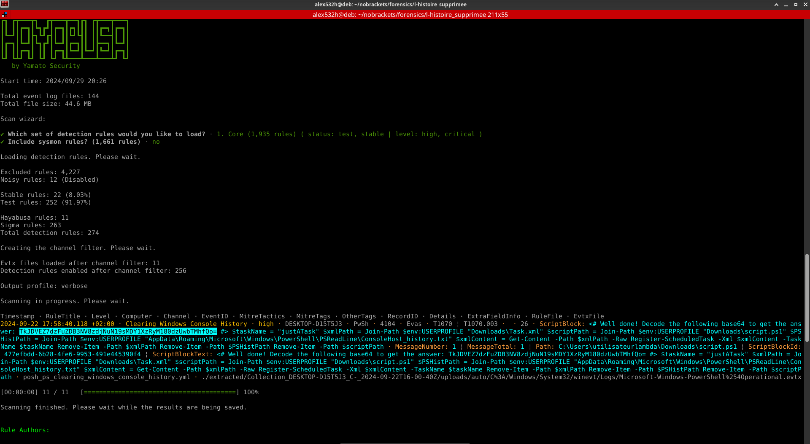

# L'histoire supprimée 1/2

## Vérification de l'intégrité

Une bonne pratique à avoir en forensics est de vérifier, quand c'est possible, l'intégrité des données.

Pour cela, comme on a un checksum SHA1, on utilise la commande:
```bash
cat SHA1SUM | sha1sum -c -
```


## Enoncé

> Notre système de détection nous a remonté une alerte d'exécution de code sur un poste.
Malheureusement au moment du dump, l'historique de commandes powershell a été effacé. 
Y a-t-il moyen de quand même les retrouver ?

D'après l'énoncé, nous savons que des commandes powershell ont été exécutées et que le fichier contenant l'historique a été vidé ou supprimé.

Cependant, un moyen permetterai quand même de les récupérer.

## Extraction des données

Avant de pouvoir commencer la résolution, il est nécessaire d'extraire les données de la collecte compressée.
> **NOTE:** Cette archive est chiffrée.

### Manuelle

Il est possible d'extraire les données en dézippant l'archive normalement sur son système. Il sera alors demandé un mot de passe. Prenez celui contenu dans le fichier `data-zip_key`:
`d661939bc6d619b49b16602ce513a4d3df777a562a0d160649`.

Toutefois, il peut arriver que la méthode de compression ne soit pas supportée (ex: xarchiver). Il est possible alors de soit se tourner vers un autre extracteur (comme Engrampa), ou alors d'utiliser l'outil du CERT-EDF: generaptor

### Generaptor (CERT-EDF)

Le CERT EDF a publié un outil permettant de gérer facilement les collectes: [generaptor](https://github.com/CERT-EDF/generaptor)

Il permet dans notre cas d'extraire facilement les données collectées.

Comme l'archive est chiffrée, un mot de passe sera demandé. Il faudra prendre celui contenu dans `velociraptor_key`:
`PjXJpoPViwSNcy9KFSDnCg`

```bash
generaptor extract <hash>.key.pem Collection_HOSTNAME-DOMAIN_VOLUME-_dateTtime.zip
```


## Analyse

En s'appuyant sur les données de l'énoncé, en faisant des recherches internet, on peut trouver qu'il faut regarder dans les journaux d'évènement windows pour l'EventID 4104.

L'utilisation des indices peut aider à orienter les recherches.

Une fois que l'on a connaissance de cette information on peut chercher à ouvrir ces journaux afin de trouver l'information désirée.
> NOTE: les evtx sont localisés dans `C:\Windows\System32\winevt\Logs\`

Sous windows, l'observateur d'évènements suffira. 
> NOTE: le journal d'évènement qui nous intéresse est `Microsoft-Windows-PowerShell%4Operational.evtx`


Cependant sous linux, l'utilisation d'un outil est fortement recommandé.

Dans mon cas, j'ai utilisé [hayabusa](https://github.com/Yamato-Security/hayabusa).

```bash
hayabusa csv-timeline --directory ./extracted/Collection_DESKTOP-D15T5J3_C-_2024-09-22T16-00-40Z/uploads/auto/C%3A/Windows/System32/winevt/Logs/ -p verbose
```


On peut laisser les options par default.



On lit le script et voit le message en commentaire:
```
Well done! Decode the following base64 to get the answer: TkJDVEZ7dzFuZDB3NV8zdjNuN19sMDY1XzRyM180dzUwbTMhfQo=
```

On décode et obtient le flag:
```bash
echo "TkJDVEZ7dzFuZDB3NV8zdjNuN19sMDY1XzRyM180dzUwbTMhfQo=" | base64 -d
```


```
NBCTF{w1nd0w5_3v3n7_l065_4r3_4w50m3!}
```
