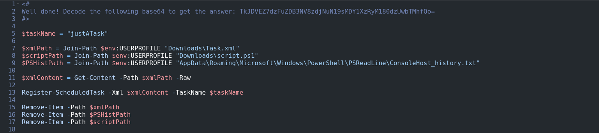
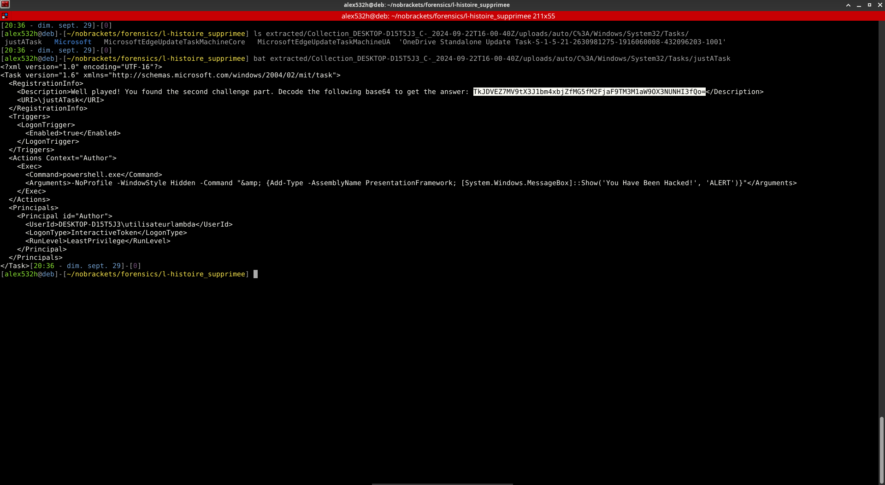
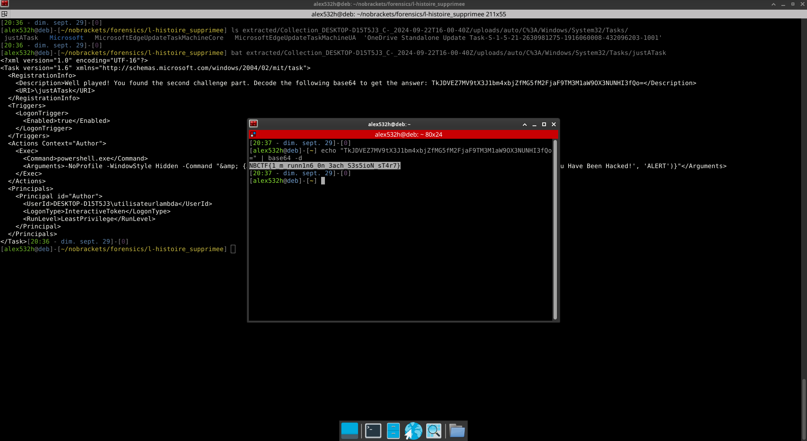

# L'histoire supprimée 2/2

## Enoncé

> Super ! Vous avez réussi à retrouver les commandes qui ont été exécutées.
Pouvez-vous les analyser et déterminer ce qu'il se passe ?

Nous avons réussi à récupérer le script exécuté. On nous demande maintenant de creuser d'avantage pour comprendre l'état de l'infection.

## Analyse

Commençons par mettre en forme et analyser le script PowerShell.



```ps1
<#
Well done! Decode the following base64 to get the answer: TkJDVEZ7dzFuZDB3NV8zdjNuN19sMDY1XzRyM180dzUwbTMhfQo=
#>

$taskName = "justATask"
$xmlPath = Join-Path $env:USERPROFILE "Downloads\Task.xml"
$scriptPath = Join-Path $env:USERPROFILE "Downloads\script.ps1"
$PSHistPath = Join-Path $env:USERPROFILE "AppData\Roaming\Microsoft\Windows\PowerShell\PSReadLine\ConsoleHost_history.txt"

$xmlContent = Get-Content -Path $xmlPath -Raw

Register-ScheduledTask -Xml $xmlContent -TaskName $taskName

Remove-Item -Path $xmlPath
Remove-Item -Path $PSHistPath
Remove-Item -Path $scriptPath
```

Le script commence par initialiser des variables contenant:
- ce qui semble être un nom de tâche planifiée
- des chemins d'accès à des fichiers

Puis il récupère le contenu du fichier xml, avant d'enregistrer une tâche planifiée ayant pour paramètres:
- le contenu du fichier xml
- le nom de la tâche

Enfin, il supprime l'ensemble des fichiers pointés par les variables.

Après vérification, il n'y a effectivement pas les fichiers pointés dans la collecte.

Comme, nous avons pu récupérer l'historique des commandes ainsi que le script PowerShell, essayons de récupérer le contenu du fichier xml.

Après recherches, il apparait que les tâches planifiées sont enregistrées à plusieurs endroits dans windows:
- dans les registres
- dans le système de fichier: `C:\Windows\System32\Tasks\`
> NOTE: /!\ cette liste n'est pas exhaustive /!\

On cherche dans le chemin et bingo on trouve un fichier xml nomme `justATask`.



Il s'agit d'une tâche planifiée s'exécutant à chaque démarrage de session et qui affiche une box pop-pup d'alerte annonçant qu'on a été infecté via l'exécution d'une commande PowerShell.
> NOTE: les tâches planifiées sont un des moyens pour un attaquant de persister dans un système.  
De plus, en le couplant avec des LolBas (équivalent GTFObins sous windows), il est possible de faire exécuter des commandes régulièrement avec des droits élevés.

On regarde son contenu et on obtient le flag encodé en base64.



```bash
echo "TkJDVEZ7MV9tX3J1bm4xbjZfMG5fM2FjaF9TM3M1aW9OX3NUNHI3fQo=" | base64 -d
```

```
NBCTF{1_m_runn1n6_0n_3ach_S3s5ioN_sT4r7}
```
