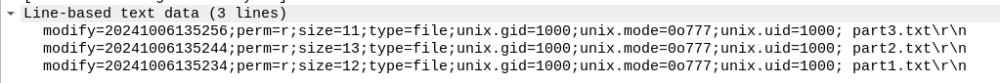

# Multi Protocoles

## FTP

Au début on voit du traffic FTP. La connexion est anonyme. Le paquet 36 est la récupération de l'énumération des fichiers :



On voit trois fichiers `part1.txt`, `part2.txt`, `part3.txt`. Cela correspond à la description.

Le paquet 68 est la requête de téléchargement de `part1.txt`, la réponse est dans la paquet 73 :


```
NBCTF{W1res
```

## SMB

La suite du pcap montre du SMB. Le paquet 171 indique les 3 mêmes fichiers que précédemment. Ensuite on voit eaucoup de bruit (demande des propriétés de `part2.txt`) et les paquets 344 et 345 sont la requête et la réponse pour le téléchargement de ce fichier :

```
h4rk_1s_s0_f
```

## NFS

SMB est très bruyant mais en regardant les autres protocoles on voit aussi un peu de NFS. Il est également possible de voir tous le sprotocoles utilisés en allant dans "Statistiques > Hiérarchie des protocoles".

Le paquet 449 contient le contenu de `part3.txt` :

```
un_to_us3}
```

Flag : `NBCTF{W1resh4rk_1s_s0_fun_to_us3}`