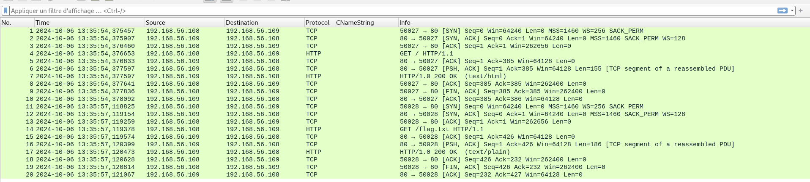
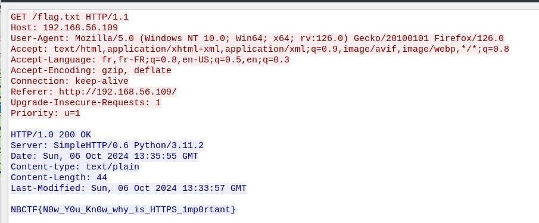

# Protocole Simple

On ouvre le fichier `.pcap` dans Wireshark :

On voit 2 requêtes HTTP : une sur la page d'accueil `/` et une sur `/flag.txt`.

On fait un clic droit sur la requête de `flag.txt` puis "Suivre > Flux HTTP".

On récupère le flag : `NBCTF{N0w_Y0u_Kn0w_why_is_HTTPS_1mp0rtant}`