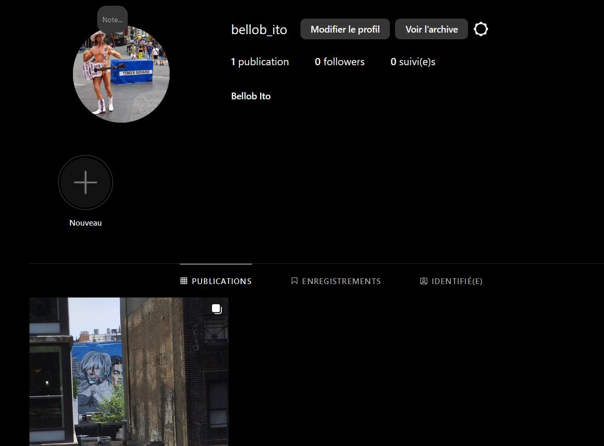
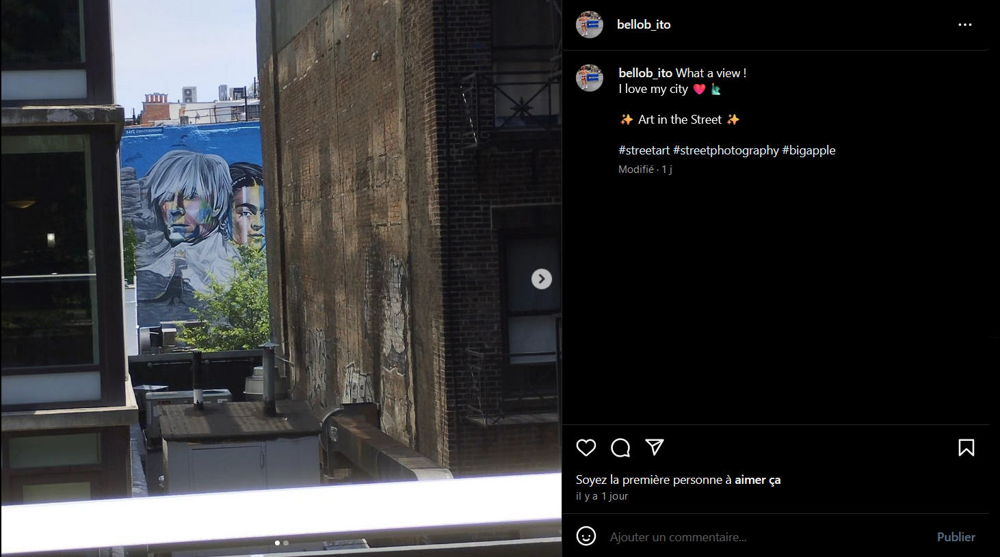
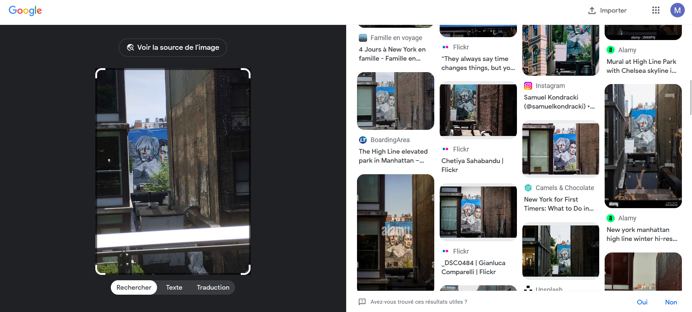
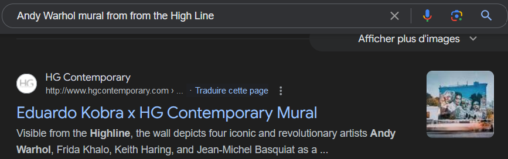
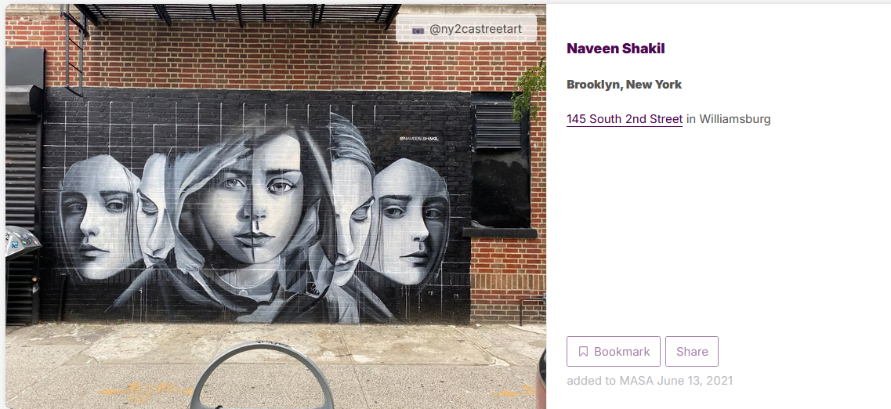

En cherchant sur Instagram on tombe sur le compte bellob_ito de son vrai nom Bellob Ito, un sacré personnage !

Sur son compte Instagram, on a un post qui parle de Street Art 

https://www.alamy.com/view-of-andy-warhol-mural-from-from-the-high-line-a-linear-park-and-greenway-in-chelsea-in-the-west-side-of-manhattan-new-york-city-usa-image502982218.html

Andy Warhol mural from from the High Line

Eduardo Kobra

Pour la deuxième image, on n'a pas de résultat satisfaisant ni sur Google image ni sur Yandex.
On commence donc à regarder les zones de New-York connu pour leur street art.

https://www.sybariscollection.com/new-york-city-art-scene-lower-east-side-bronx-brooklyn/

Lower East Side, the Bronx & Brooklyn

https://findmasa.com/city/brooklyn

