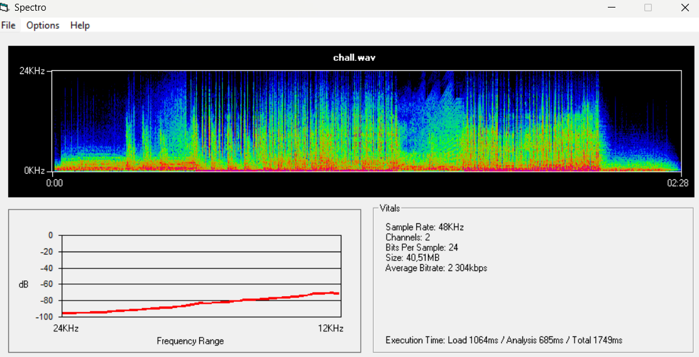

## WU - Juste un petit peu de LSB
#### Analyse du fichier
On commence par vérifier le type de wav avec un outil comme Spectro :

C'est un fichier wav avec une fréquence d'échantillonnage de 48Khz, 2 canaux et surtout un bitrate (une profondeur) de 24 bits, ce qui veut dire que chaque échantillon est composé de 24 bits

#### Résolution du chall

Avec le titre on se doute que le flag a été caché sur les LSB, il va falloir donc extraire le bit de point faible des échantillons du fichier audio et convertir le tout en texte, on part du principe que le flag n'est pas forcément écris au début du fichier (même si là c'est le cas) donc dans notre script on récupère tout et on printera tout à la fin pour chercher le flag.
En cherchant un peu sur le net/chatGPT on utilise ce script :

    import wave
    cover_wav = wave.open("chall.wav", mode='rb')
    frames = bytearray(cover_wav.readframes(cover_wav.getnframes()))
    message_ex = []
    value = 0
    j = 0
    for i in range(0, len(frames), 3):
	    msg_bit = frames[i]%2
	    if j%8==0 and j!=0:
	        message_ex.append(value)
	        value = 0
	    value |= msg_bit << j%8
	    j+=1
    with open("flag", "w", encoding="utf-8") as f:
	    f.write(str(''.join([chr(l) for l in message_ex])))
    cover_wav.close()
Les points importants du code sont la boucle principale qui va de 3 en 3 car avec un fichier qui a une profondeur de 24bits, il faut 3 octets pour constituer un échantillon, le wav utilise le little endian comme format pour stocker ses infos, donc le premier octet est l'octet de poids faible du premier échantillon du morceau, on commence donc à extraire nos bits à partir du premier octet et on passe aux octets suivants de 3 en 3. On écrit tout à la fin dans un fichier texte et il suffit de ctrl+f NBCTF{ pour trouver le flag

