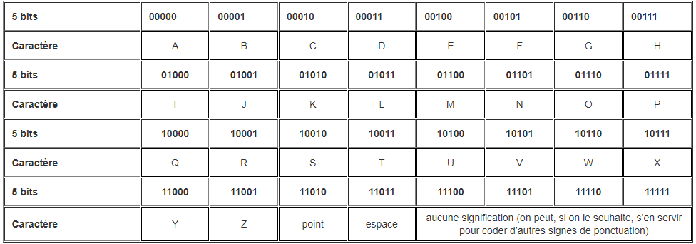

# WU : Mysterious tract :newspaper: 
  
Lors de la première lecture de l'ensemble du tract. On peut mettre en valeur des éléments importants
  
* Un texte de propagande qui semble cacher des indices 
* Une image avec des 0 et des 1 ainsi qu'un message "JOIN US"
* Des petites indications partout sur le tract (exemple -> "4" : "11101")
  
Ce qu'il faut retenir : 
  
- Le texte met en valeur les indices suivants : 
  
* Il y a un message secret indiquant le lieu de rendez-vous
* 00000 vaut "A" 
* il suffit de rajouter un bit pour passer au caractère suivant soit 00001 vaut "B" 
* le sens de lecture est du haut vers le bas 
  
On peut alors se baser sur ce tableau pour avoir la suite des caractères
  
  

  
Il y a donc les caractères spéciaux qui sont indiqués dans le tract :
  
* 11100 pour "3"
* 11101 pour "4"
* 11110 pour "0"
* 11111 pour "_"
  
Ensuite, on fait lettre par lettre la chaîne de caractère en bits, ce qui donne les résultats suivants :
  
J = 10100 10010 01000 01101 111  
O = 00 11111 00010 11101 10010  
I = 10011 11110 11  
N = 111 00100 01101 10011 10001 11100 011  
  
U = 11 11110 10011 11111  01101 10100 01  
S = 100 11100 10001 01110 11111 11100  
  
Puis, on traduit tout les 5 bits pour trouver le caractère :
  
`USIN3_` = 10100 10010 01000 01101 11100 11111  
`C4ST0_` = 00010 11101 10010 10011 11110 11111  
`ENTR3P0T_` = 00100 01101 10011 10001 11100 01111 11110 10011 11111  
`NUM3RO_3` = 01101 10100 01100 11100 10001 01110 11111 11100  
  
On a donc le flag complet avec le format NBCTF : `NBCTF{usin3_c4st0_entr3p0t_num3ro_3}`

